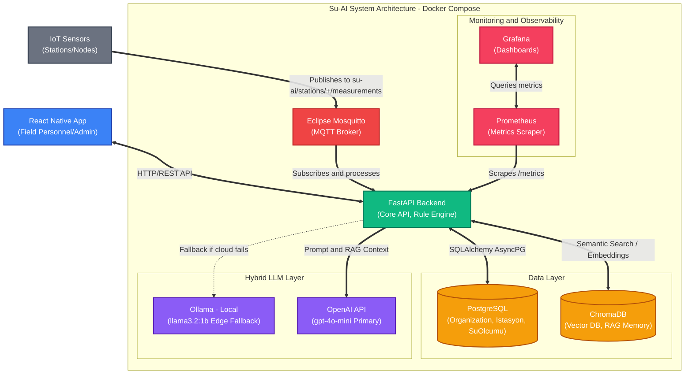

# Su-AI Project

## Architecture

Su-AI is an IoT + LLM-powered water quality monitoring platform built for Sanliurfa Water Authority. It combines a rule-based anomaly engine with a hybrid LLM layer (cloud-first with local fallback) and RAG-based institutional memory to turn sensor readings into actionable technical recommendations for field personnel.



## Getting Started with Docker

We provide a production-grade Docker Compose setup that orchestrates all necessary backend services (FastAPI, PostgreSQL, ChromaDB, and Ollama) with a single command.

### Prerequisites
- [Docker](https://docs.docker.com/get-docker/) installed.
- [Docker Compose](https://docs.docker.com/compose/install/) installed.

### Setup Instructions

1. **Configure Environment Variables**
   Copy the provided example template to create your local `.env` file:
   ```bash
   cp .env.example .env
   ```
   Open the `.env` file and fill in any required keys (like your `OPENAI_API_KEY`). Note that the database and internal service coordinates are already configured to work seamlessly inside the Docker network.

2. **Local Overrides (Optional)**
   If you need to expose different ports or add debug environment variables locally without affecting the shared `docker-compose.yml`:
   ```bash
   cp docker-compose.override.yml.example docker-compose.override.yml
   ```

3. **Start the Stack**
   Bring up the entire stack using the `Makefile` shortcut:
   ```bash
   make up
   ```
   *Alternatively, if you don't have `make` installed:*
   ```bash
   docker-compose up -d
   ```

4. **Useful Makefile Commands**
   - `make up`: Start all services in the background.
   - `make down`: Stop all services.
   - `make logs`: View combined logs of all services.
   - `make rebuild`: Force rebuild the Docker images and start.
   - `make db-shell`: Open an interactive psql shell in the database container.
   - `make backend-shell`: Open a bash shell in the backend container.

### Testleri Çalıştırma

Projede `pytest` ve `pytest-asyncio` tabanlı kapsamlı bir test altyapısı bulunmaktadır. Testler, izole edilmiş bir `su_ai_test` Postgres veritabanı üzerinde her testte işlem geri alımı (transaction rollback) yöntemiyle hızlıca çalışır.

Testleri Docker container içerisinde çalıştırmak için:
```bash
docker exec -t su-ai-backend pytest -v tests/
```

### Architecture Notes
- The backend API runs on port `8080` on the host (mapped to `8000` inside the container).
- ChromaDB runs on port `8000` on the host.
- Ollama runs on port `11434` on the host.
- PostgreSQL runs on port `5432` on the host.

### Multi-Tenancy / SaaS Architecture
Su-AI uses a robust multi-tenancy model to isolate data securely between different organizations (tenants).
- **Data Isolation:** All data querying (Stations, Measurements, Users, etc.) explicitly enforces the `organization_id` at the database level.
- **Backwards Compatibility:** Legacy configurations and users are safely ported to a "Default Organization" automatically via Alembic migrations.
- **Tenant Management:** Organization administrators and system users can manage tenants and assign users safely via the `/admin/organizations` endpoints.
