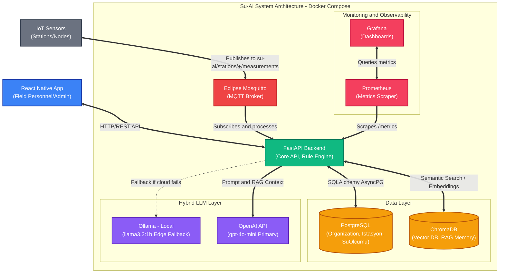

# Su-AI

**IoT + LLM-powered water quality monitoring and decision-support platform**, built for the Şanlıurfa Water and Sewerage Authority (ŞUSKİ).

Su-AI combines a rule-based anomaly engine with a hybrid LLM layer (cloud-first with local fallback) and RAG-based institutional memory to turn raw sensor readings into actionable technical recommendations for field personnel — in Turkish, and grounded in real regulatory thresholds (TS 266).

Unlike a traditional SCADA system that only fires threshold alarms, Su-AI explains **why** an alarm fired and **what to do about it**.

---

## Architecture



### Components

| Layer | Technology |
|---|---|
| Backend | Python 3.13, FastAPI (async/await), SQLAlchemy async ORM, Alembic |
| Database | PostgreSQL |
| Mobile | React Native (Expo) |
| IoT ingestion | Eclipse Mosquitto (MQTT), `paho-mqtt` |
| Vector DB | ChromaDB (`all-MiniLM-L6-v2` local embeddings) |
| LLM | OpenAI `gpt-4o-mini` (primary), Ollama `llama3.2:1b` (local edge fallback) |
| Observability | Prometheus, Grafana |
| Containerization | Docker Compose |
| CI/CD | GitHub Actions (Ruff lint/format, pytest + 90% coverage gate) |

---

## AI/ML Layer

**Rule-based anomaly engine** — three layers:
- Hardcoded TS 266 safety thresholds (e.g. pH < 6.5 or > 9.5 → critical)
- Dynamic per-organization thresholds, stored in the database
- Admin-defined combinational rules (Python-syntax, `ast.parse()`-validated, sandboxed `eval()`)

**LLM narrator** — does not detect anomalies itself; it takes the rule engine's structured output plus RAG-retrieved similar past cases and generates a Turkish, field-ready action plan. Cloud-first (`gpt-4o-mini`) with automatic fallback to a local Ollama model if the API is unreachable — critical for uninterrupted operation in the field.

**RAG institutional memory** — ChromaDB semantic search over past incidents, retrieving the top-2 most similar historical cases to ground the LLM's recommendations in real precedent rather than generic advice.

**Predictive engine** — Holt's linear exponential smoothing projects the next reading and a trend risk score; physical bounds (e.g. pH 0–14) are applied only after the risk score is computed, so clipping never distorts the risk signal.

**LLM-as-a-Judge** — a second LLM call scores every narrator output for quality (0–100) in the background. RAG-sourced case references are explicitly flagged as verified institutional memory so the judge doesn't mistake them for hallucination.

---

## Security

- JWT (HS256) — 30-minute access tokens, 7-day refresh tokens, `jti`-based blocklist for real logout
- RBAC — `saha_personeli` (field staff) and `yonetici` (admin) roles
- Multi-tenancy — see below
- Audit logging of critical actions
- Rate limiting (`slowapi`) on auth endpoints, bcrypt password hashing

---

## Getting Started with Docker

We provide a production-grade Docker Compose setup that orchestrates all necessary backend services (FastAPI, PostgreSQL, ChromaDB, and Ollama) with a single command.

### Prerequisites

- [Docker](https://docs.docker.com/get-docker/) installed
- [Docker Compose](https://docs.docker.com/compose/install/) installed

### Setup Instructions

**1. Configure environment variables**

Copy the provided example template to create your local `.env` file:

```bash
cp .env.example .env
```

Open `.env` and fill in any required keys (like your `OPENAI_API_KEY`). Database and internal service coordinates are already configured to work seamlessly inside the Docker network.

**2. Local overrides (optional)**

If you need to expose different ports or add debug environment variables locally without affecting the shared `docker-compose.yml`:

```bash
cp docker-compose.override.yml.example docker-compose.override.yml
```

**3. Start the stack**

```bash
make up
```

Or, without `make`:

```bash
docker-compose up -d
```

**4. Useful Makefile commands**

| Command | Description |
|---|---|
| `make up` | Start all services in the background |
| `make down` | Stop all services |
| `make logs` | View combined logs of all services |
| `make rebuild` | Force rebuild the Docker images and start |
| `make db-shell` | Open an interactive `psql` shell in the database container |
| `make backend-shell` | Open a bash shell in the backend container |

### Running Tests

The project has a comprehensive `pytest` + `pytest-asyncio` test suite. Tests run against an isolated `su_ai_test` PostgreSQL database, with per-test transaction rollback for speed.

To run tests inside the Docker container:

```bash
docker exec -t su-ai-backend pytest -v tests/
```

### Architecture Notes

- Backend API runs on host port `8080` (mapped to `8000` inside the container)
- ChromaDB runs on host port `8000`
- Ollama runs on host port `11434`
- PostgreSQL runs on host port `5432`

---

## Multi-Tenancy / SaaS Architecture

Su-AI uses a robust multi-tenancy model to isolate data securely between different organizations (tenants).

- **Data isolation** — all queries (stations, measurements, users, etc.) explicitly enforce `organization_id` at the database level
- **Backwards compatibility** — legacy configurations and users are safely ported to a "Default Organization" automatically via Alembic migrations
- **Tenant management** — organization admins and system users can manage tenants and assign users via the `/admin/organizations` endpoints

---

## CI/CD

Every push and pull request to `main` triggers GitHub Actions:

1. Set up Python 3.10
2. Install dependencies
3. `ruff check app` — lint
4. `ruff format --check app` — format consistency
5. `pytest --cov=app.engine --cov-fail-under=90` — tests + coverage gate

CI runs against a real PostgreSQL 15 service container (not in-memory SQLite), so the test environment closely mirrors production.

---

## Project Status

Actively developed as part of an internship at ŞUSKİ (Şanlıurfa Water and Sewerage Authority).

## Author

**Merve Aiseoglu** — Computer Engineering, Harran University
